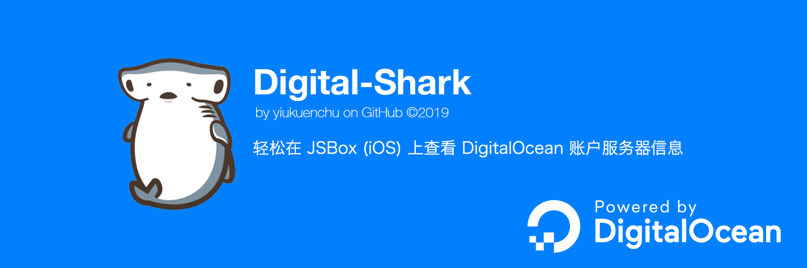
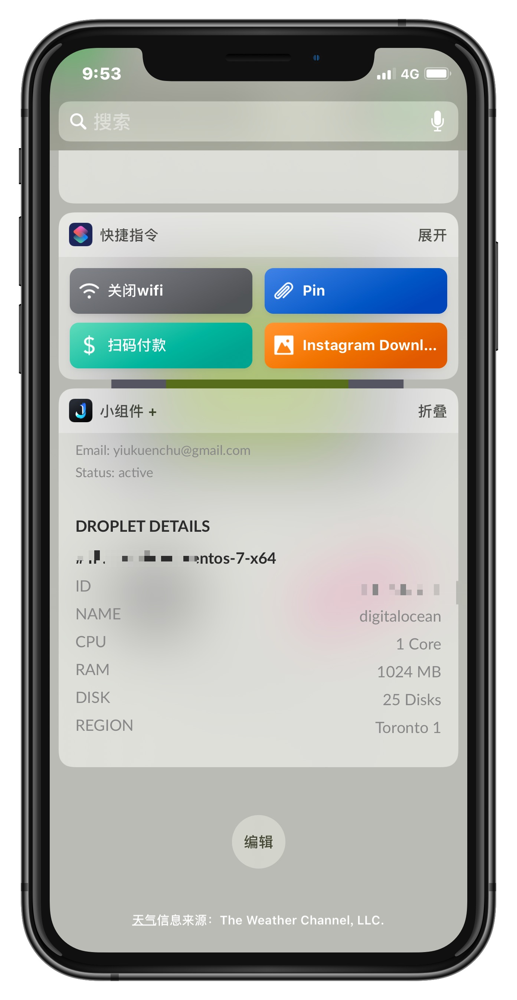
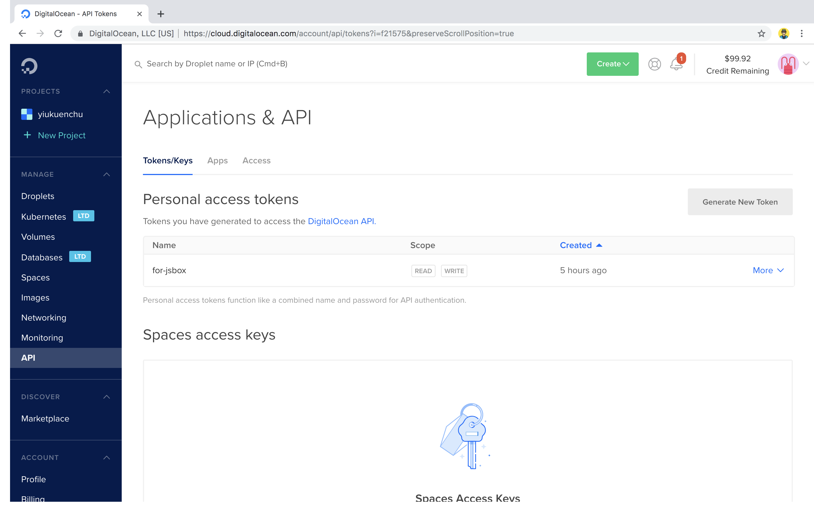

<br>

# 🦈 Digital-Shark


此脚本需要配合 JSBox（iOS）使用，用于观测 DigitalOcean Droplet 服务器的情况。  

Digital-Shark 利用 [DigitalOcean](https://developers.digitalocean.com/) 官方提供的 API 查询到账户和服务器的信息。  

建议把 Digital-Shark 添加到手机负一屏的 JSBox 小组件中。

<div align=center>
    
</div>

<br>

## 1.生成属于你的 Token

点开这个链接 📎[DigitalOcean Token](https://cloud.digitalocean.com/account/api/tokens) 生成只属于你的 Token。


  
<br>

## 2.生成你想观测的服务器 ID

在终端里运行代码：

```shell
curl -X GET -H "Content-Type: application/json" -H "Authorization: Bearer YOUR_TOKEN" "https://api.digitalocean.com/v2/droplets"
```

记得将上述代码中的 ```YOUR_TOKEN``` 替换成你在第 1 步中生成的 Token。  返回的结果是你的账户中所有的 Droplet 服务器的信息，其中包括服务器的 ID，位置应该服务器信息在开头。  

记下你想要观测的 DropletID。

## 3.修改源码中的配置
在源文件 ```digital-shark.js```的最开头，用上述步骤得到的 **Token** 和 **DropletID** 修改配置信息。

随后点击运行即可。

## 4.推荐添加到小组件
推荐将本脚本添加到负一屏的小组件中，若如此做，推荐视图高度设置为 290。

# 感谢

本项目参考了 Spencer Woo 的 [Vultr Helper](https://github.com/yiukuenchu/jsbox-vultr-helper)。  

🕶️ 他是个很酷的人！这是他的博客。 📎https://spencerwoo.com/

🌟 如果你觉得 Digital-Shark 对你有帮助，欢迎 Star 和 Fork。 📎https://github.com/yiukuenchu/jsbox-digital-shark

# License

Released under MIT License.